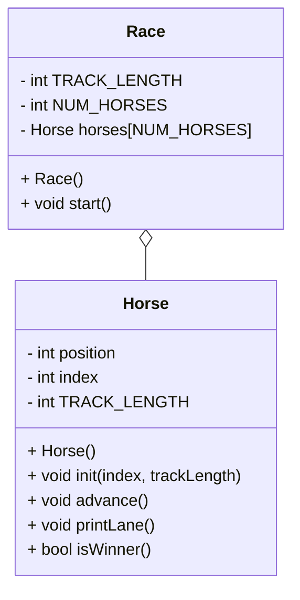

# CS121_Project_4_Beck
## (lab) OOP horse race

### UML Diagram


### class race()
```
in header:
    set const static int NUM_HORSES = 5;
    intialize TRACK_LENGTH to 15
    intialize horse array
in constructor:
    go through each horse
    intialize that horse with id and track length
```

### void start()
```
set keepGoing to true
    while keepGoing
        for each horse:
            advance that horse
            print that horse's lane
            if that horse is finished:
                announce the winner
                set keepGoing to false
```

### class horse()
```
set position, index, trackLength
```

### void init(index, trackLength)
```
intialize index
intialize trackLength
```

### void advance()
```
add coin to horse's position value in the array
```

### void printLane()
```
for i from zero to TRACK_LENGTH:
    if current loop index is equal to the horse's value:
        print the horseNum
    else:
        print .
```

### bool isWinner()
```
result = false
if a horse's value is equal to TRACK_LENGTH:
    result = true
    print Horse {horseNum} wins!!!
return result
```

### int main()
```
seed random number generator
initiate Race instance
start race
```